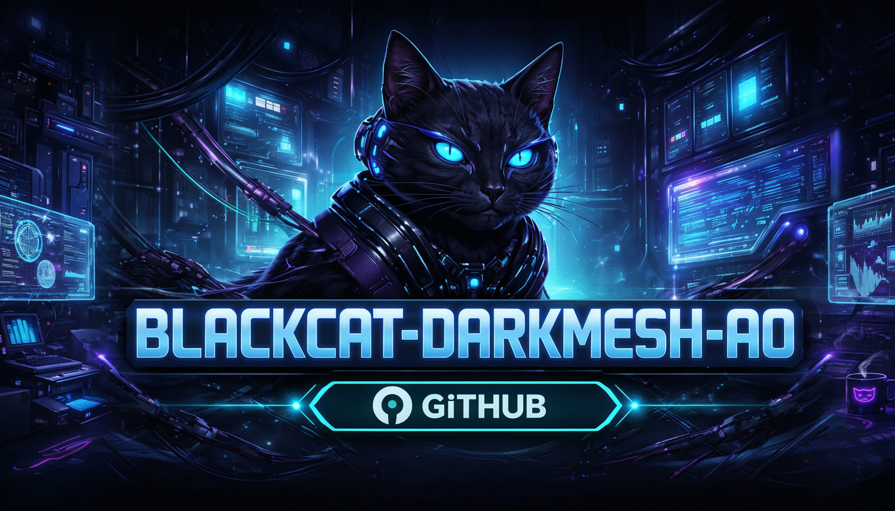

# blackcat-darkmesh-ao
[](https://github.com/users/Vito416/projects/2) [](https://github.com/Vito416/blackcat-darkmesh-ao/actions/workflows/ci.yml)



AO-first backend layer for Blackcat Darkmesh. This repository hosts AO processes, message contracts, schemas, Arweave manifests, and runbooks that power the permaweb runtime. Source is available under `BFNL-1.0`: audit, local development, and testing are allowed, while production/network operation is conditional on founder-fee compliance (see `LICENSE` and `docs/licensing.md`).

## Scope
- In scope: AO processes for public state (site registry, routing, public read model, audit metadata, permission registry), schemas, Arweave manifests/snapshots, deploy/verify/export scripts, fixtures, CI workflows.
- Out of scope: command validation/idempotency, builder/admin UI, template/rendering layer, SMTP/OTP/payments business logic, mailbox payload persistence, full resolver/gateway runtime, or any storage of sensitive plaintext. Mutations are owned by `blackcat-darkmesh-write`.
- Exception: this repo includes thin HTTP compatibility adapters (`scripts/http/public_api_server.mjs` and `worker/src/index.ts`) with a limited route subset (see "Gateway Adapter Surface").

## Architecture Snapshot
- Process split: `router`/`registry` (domains, sites, keys), `public_state` (routes, pages, navigation, SEO/public config), `catalog` (public product + category payloads/refs), `permissions` (publish keys/roles), and `audit` (receipts + references only).
- Data model: document/NoSQL for hot public state; immutable payloads live on Arweave with hashes/manifests stored here.
- Ingress: **only** published events from `blackcat-darkmesh-write`; AO applies them to public state.
- Read path: gateways/resolvers fetch AO state and follow Arweave refs; AO remains secretless and cache-friendly.
- Deterministic handlers and stable message names for public contracts.

## Repository Layout (blueprint)
```
docs/              # Architecture, runbooks, ADRs
ao/                # AO processes and shared libs
  registry|site|catalog|access/
  shared/          # auth, codec, validation, ids
arweave/           # manifests, snapshots, asset index, encryption policies
schemas/           # JSON schemas for pages, routes, products, publish, entitlements
scripts/           # deploy | verify | seed | export
fixtures/          # sample site, catalog, publish data
tests/             # integration, message-contracts, snapshots, security
.github/workflows/ # CI entrypoint
```

## Message Contract (public AO surface)
- Read (public/tenant-scoped): `GetSiteByHost`, `ResolveGatewayForHost`, `ListGateways`, `ResolveRoute`, `GetPage`, `GetLayout`, `GetNavigation`, `GetProduct`, `ListCategoryProducts`, `HasEntitlement`.
- Integrity registry reads: `GetTrustedRoot`, `GetTrustedReleaseByVersion`, `GetTrustedReleaseByRoot`, `GetIntegrityPolicy`, `GetIntegrityAuthority`, `GetIntegrityAuditState`, `GetIntegritySnapshot`.
- Ingest (from `blackcat-darkmesh-write` only): publish/apply events carrying `Action`, `Site-Id`, `Publish-Id`, `Version`, `Schema-Version`, `Timestamp`, `Request-Id`, `Signature-Ref` and content hashes/refs. No direct write commands are accepted from gateways/clients.
- Integrity registry writes (admin/registry-admin only): `PublishTrustedRelease`, `RevokeTrustedRelease`, `SetIntegrityPolicyPause`, `SetIntegrityAuthority`, `AppendIntegrityAuditCommitment`.
- Gateway directory writes (admin/registry-admin only): `RegisterGateway`, `UpdateGatewayStatus`.
- Standard tags for read responses: `Action`, `Site-Id`, `Version`, `Locale`, `Request-Id`, `Schema-Version`, `Nonce` (optional for cache-busting).

## Gateway Adapter Surface (implemented now)
- Read routes:
  - `POST /api/public/resolve-route` -> `ResolveRoute`
  - `POST /api/public/page` -> `GetPage`
- Write routes (worker adapter):
  - `POST /api/checkout/order` -> `CreateOrder`
  - `POST /api/checkout/payment-intent` -> `CreatePaymentIntent`
- Health endpoints:
  - `GET /healthz` (node adapter in `scripts/http/public_api_server.mjs`)
  - `GET /health` and `GET /api/health` (worker adapter in `worker/src/index.ts`)
- Not yet implemented as adapter routes: additional registry/catalog/access reads (for example `GetSiteConfig`, `GetCategory`, `ListCategories`, `SearchCatalog`, `FacetSearch`, `GetTrustedResolvers`, `GetResolverFlags`) and write routes for payment webhook/status updates, passwordless session actions, and gateway-flag submissions.

## Publish Model (apply-only)
1) `blackcat-darkmesh-write` validates and approves a mutation, producing a publish event (`publishId`, `versionId`, hashes, refs).  
2) AO consumes the event, updates public state (registry/router/public_state/catalog/permissions) and pins refs/hashes only.  
3) Immutable payloads are already pinned to Arweave by the publisher; AO stores tx IDs and hashes.  
4) History remains append-only for audit/rollback; AO never stores draft/plaintext payloads.

## Roadmap
See `docs/ROADMAP.md` for the AO/Write split aligned to the v2 architecture briefs.

## Usage Notes
- Keep hot state small; push large or historical payloads to Arweave.
- Never store private keys, seeds, or plaintext secrets in AO state or metadata; only references and hashes belong here.
- All comments and documentation in this repository stay in English.

## Development
- Prereqs: `python3` (3.8+) and Lua (`lua5.1`–`lua5.4`) with rocks `lua-cjson` and `libsodium` headers for native crypto. `luv`, `lsqlite3`, and `luaossl` are optional in preflight (runtime has fallback paths); set `DEPS_REQUIRE_LUV=1` to enforce `luv` in CI when needed. Run `lua scripts/verify/deps_check.lua` to verify.
- Run static checks before opening a PR: `scripts/verify/preflight.sh`.
- Contract smoke tests are bundled in the preflight script (runs under Lua 5.4).
- Branches: `main` (releasable), `develop` (integration), `feature/*`, `adr/*`, `release/*`.
- Message contracts and schemas are treated as public API; prefer additive changes over breaking ones.
- Role policy: write actions are gated by actor roles (registry/site/catalog/access); provide `Actor-Role` tag in messages to pass policy checks.
- Arweave config (mock-safe by default):
  - `ARWEAVE_MODE` (`mock`|`http`) — mock persists snapshots locally; http logs intended requests only.
  - `ARWEAVE_HTTP_ENDPOINT`, `ARWEAVE_HTTP_API_KEY`, `ARWEAVE_HTTP_SIGNER` — only logged in http mode.
  - `ARWEAVE_HTTP_TIMEOUT` seconds; requests are simulated/offline but logged with this value.
  - `ARWEAVE_HTTP_REAL=1` enables actual HTTP POST via curl (still logs responses); keep unset for offline.
  - `ARWEAVE_HTTP_SIGNER_HEADER` custom header name for signer path (default `X-Arweave-Signer`); signer file must exist when `*_REAL=1`.
- Audit config: `AUDIT_LOG_DIR` (default `arweave/manifests`), `AUDIT_MAX_RECORDS` (default 1000 in-memory).
  - `AUDIT_FORMAT` (`line`|`ndjson`), `AUDIT_ROTATE_MAX` bytes for log rotation.
  - `AUDIT_RETAIN_FILES` rotated log files per stream (default 10).
- Audit export tooling:
  - `scripts/export/audit_dump.lua [N] [process]` — tail audit logs (mock-safe).
  - `scripts/export/audit_export.lua [process|all] [format] [outfile]` — export NDJSON or raw.
  - `scripts/export/audit_ci.sh [outfile]` — CI-friendly helper; writes `artifacts/audit.ndjson` if logs exist (no-op otherwise).
- Payload caps (env overrides):
  - `SITE_MAX_CONTENT_BYTES` (draft/page content, default 64 KiB)
  - `CATALOG_MAX_PAYLOAD_BYTES` (product/category payloads, default 64 KiB)
  - `ACCESS_MAX_POLICY_BYTES` (entitlement policy payloads, default 32 KiB)
  - `REGISTRY_MAX_CONFIG_BYTES` (site config payload, default 16 KiB)
- Idempotency cache: `IDEM_TTL_SECONDS` (default 300s) and `IDEM_MAX_ENTRIES` (default 1024) bound the in-memory Request-Id store.
- Security hooks: nonce/signature optional enforcement (`AUTH_REQUIRE_NONCE`, `AUTH_REQUIRE_SIGNATURE`), nonce TTL (`AUTH_NONCE_TTL_SECONDS`), rate limit window (`AUTH_RATE_LIMIT_WINDOW_SECONDS`) and max (`AUTH_RATE_LIMIT_MAX_REQUESTS`).
- Signature check uses HMAC-SHA256 over the canonical payload (all fields except `Signature`, including `Nonce`/`ts`), with `AUTH_SIGNATURE_SECRET` (requires `openssl` when enforcement is on).
- Optional JWT gate: set `AUTH_JWT_HS_SECRET` (HS256) and optionally `AUTH_REQUIRE_JWT=1` to fail-closed; claims `sub/tenant/role/nonce` are mapped to `Actor-Id`/`Tenant`/`Actor-Role`/`Nonce`.
- Rate-limit state can persist to `AUTH_RATE_LIMIT_FILE`.
- Prefer libsodium/luaossl for ed25519 when present; set `AUTH_ALLOW_SHELL_FALLBACK=0` to forbid shell fallback.
- Metrics: set `METRICS_ENABLED=1` and `METRICS_LOG` path to emit NDJSON counters; see `ao/shared/metrics.lua`.
- Prometheus export: set `METRICS_PROM_PATH` to write text exposition on flush.
- Flush cadence: `METRICS_FLUSH_INTERVAL_SEC` (tick-based timer) or `METRICS_FLUSH_EVERY` (per-N increments); no shell/background dependency.
- Catalog search: filters Query/Category-Id/MinPrice/MaxPrice/Locale/Currency/Available/Carrier; facets categories/availability/shippingStatus/price bands/currency/locales/carriers; sorts relevance/name/price asc|desc/available/newest.
- SEO helper: `lua scripts/seo/product_jsonld.lua <sku> <payload.json>` prints schema.org Product JSON-LD (price/currency/availability included).
- Trust manifest verify (resolvers list): set `TRUST_MANIFEST_HMAC` and run `lua scripts/verify/trust_manifest_verify.lua manifest.signed.json` before publishing txId to Arweave.
- Trust manifest loader: set `TRUST_MANIFEST_HMAC` and `TRUST_MANIFEST_TX` (or pass file path) and run `lua scripts/verify/trust_manifest_loader.lua` to fetch+verify and list active resolvers.
- Registry stores trusted resolvers: actions `UpdateTrustResolvers` / `GetTrustedResolvers` let ops pin the active list + manifestTx inside AO state (role: admin/registry-admin).
- Arweave HTTP: retries/backoff (`ARWEAVE_HTTP_RETRIES`, `ARWEAVE_HTTP_BACKOFF_MS`), manifest cap (`ARWEAVE_MAX_MANIFEST_BYTES`), signer hash logged when present.
- Arweave dry-run: `ARWEAVE_HTTP_DRYRUN=1` skips curl; errors on HTTP >=400 return `http_error`.
- Fuzz tests: set `RUN_FUZZ=1` to run `scripts/verify/fuzz.lua` during preflight.
- Production baseline env: see `ops/env.prod.example` (strict signatures, sqlite rate-limit, Prometheus path).

## Quickstart / Deploy (PowerShell vs shell)
The commands below ship the **schema bundle** (manifest-only), intended for dev/CI snapshots. For production, export with your curated presets and strict env (see below).

Use the built-in launcher; it detects Windows/WSL vs Linux and prints copy/paste commands:
```
python scripts/start.py
```

Deploy the latest bundle to Arweave via arkb:
- PowerShell (Windows):
```
npx arkb deploy "dev/schema-bundles/schema-bundle-*.tar.gz" --content-type application/gzip   # dev snapshot
```
- Bash (Linux/WSL):
```
./scripts/setup/build_schema_bundle.sh
  npx arkb deploy ./dev/schema-bundles/schema-bundle-*.tar.gz --content-type application/gzip   # dev snapshot
```

AO process Lua bundles (for push module publish/spawn flow):
```bash
npm install
node scripts/build-ao-bundles.mjs --all
```
See `scripts/deploy/README.md` for publish/spawn/finalization helpers.

Handy CLI helpers:
- List collections: `python scripts/setup/schema_helper.py list`
- Suggest presets from prompt: `python scripts/setup/schema_helper.py suggest --prompt "ebook shop with subscriptions"`
- Export bundle with presets: `python scripts/setup/schema_helper.py export --presets core,commerce,content,ebook,subscriptions --out dev/schema-bundles/custom.tar.gz`
- Wizard for a site-specific bundle (prompts for slug/presets): run `python scripts/start.py` and choose option **4**.
- Dependency check: `lua scripts/verify/deps_check.lua`

**Production reminders**
- Start from `ops/env.prod.example` and set:  
  - `AUTH_REQUIRE_SIGNATURE=1`  
  - `AUTH_SIGNATURE_TYPE=ed25519` and `AUTH_SIGNATURE_PUBLIC=/etc/ao/keys/registry-ed25519.pub` (or your path)  
  - `AUTH_ALLOW_SHELL_FALLBACK=0` (fail-closed if openssl/shell is missing)  
  - `AUTH_RATE_LIMIT_SQLITE=/var/lib/ao/rate.db` (persistent per-actor rate limit)  
  - `METRICS_PROM_PATH=/var/lib/ao/metrics.prom` and optionally `METRICS_FLUSH_INTERVAL_SEC=10`
  - Enable checksum watchdog for audit/queue/WAL: `ops/systemd/ao-checksum.service` + `scripts/daemon/checksum_daemon.sh` (env `AO_QUEUE_PATH`, `AO_WAL_PATH`, `AO_CHECKSUM_INTERVAL`).
  - Resolver flags: set `AO_FLAGS_PATH=/etc/ao/resolver-flags.ndjson` to block/readonly resolvers before routing.
  - Shipping/Tax preload: set `AO_SHIPPING_RATES_PATH` / `AO_TAX_RATES_PATH` to NDJSON exported from write (`scripts/export/rates.lua`).
- Key management: store public keys under `/etc/ao/keys`, record their `sha256sum` in your ops vault, and rotate on a schedule; never check private keys into the repo or CI artifacts.

### Ops runbook
See `docs/RUNBOOK.md` for start/stop, health checks, key rotation, outbox HMAC, Arweave deploy verification, and incident response procedures.

### Deployment notes
Active deployment planning/tracking lives in `AO_DEPLOY_NOTES.md` (work scope, spawn order, finalization policy, and rollout checklist).

### Write-bridge observability (from `blackcat-darkmesh-write`)
When you deploy the write bridge alongside this repo, enable its logging so AO ops can audit downstream delivery:
- Queue: set `AO_QUEUE_PATH=/var/lib/ao/outbox-queue.ndjson`, `AO_QUEUE_LOG_PATH=/var/log/ao/queue-log.ndjson`, `AO_QUEUE_MAX_RETRIES=5`.
- Bridge hashes: optionally enforce downstream body hash with `AO_EXPECT_RESPONSE_HASH=<sha256>`.
- WAL on write-side: `WRITE_WAL_PATH=/var/log/ao/write-wal.ndjson` (stores request/response hashes for every command).
These live in the **write** service; keep paths under your ops log/data locations.

## Registration fee (Arweave) — transparent onboarding
To be listed as a verified participant (gateway/site/shop) in the shared mesh, send a small on-chain fee that is public and auditable:
- Destination: `SRNyOyOGqC5xSekIZeuy1T3Fho14U3-NerC_jeDwn78`
- Amount: ~2 USD equivalent in AR (or Bundlr) minimum
- Required tags:
  - `App: blackcat-mesh`
  - `Type: gateway|site|shop`
  - `Domain: your-domain.tld`
  - `Contact: email_or_pgp`
- Optional proof-of-domain: TXT `blackcat-verify=<txid>` or signed challenge served from the domain.

What you get: inclusion in the public registry, priority support/SLA, and a tamper-evident record. Production/network rights are governed by the already-active `BFNL-1.0` model, with fee scope and payment proof rules defined in `docs/FEE_POLICY.md` and the founder notices in `docs/notices/`.

The intended policy is that this fee remains a very small, fair, one-time contribution not only for registry/support, but also as recognition of the founder's original concept, ecosystem bootstrap, and motivation for continued development.

## Schemas (WeaveDB-first)
- Canonical table definitions (columns, types, constraints) live in `schemas/canonical-db/tables/` plus the map `schemas/canonical-db/schema-map.yaml`.
- WeaveDB-ready collections are in `schemas/weavedb/collections/*.yaml` (JSON Schema + indexes); manifest v3 carries them under `weavedb`.
- Generate manifest v3: `python3 scripts/setup/make_schema_manifest.py` → `schemas/manifest/schema-manifest.json`.
- Build bundle (manifest only): `./scripts/setup/build_schema_bundle.sh`; current deployed bundle: tx `iygsD6GhCXGI1cXrl2lw6VOpxbjwISZO5pqWmo7y8XM` (sha256 `b1ee8a00d4d2c989c4d7a88daf1ca45c0ea70fb0037dd8b688d44d05f9f534d5`).

## License
Blackcat Darkmesh AO is licensed under `BFNL-1.0` (see `LICENSE`). Contribution and relicensing rules are governed by the companion documents in `blackcat-darkmesh-ao/docs/`.

This repository is an official component of the Blackcat Covered System. It is licensed under `BFNL-1.0`, and repository separation inside `BLACKCAT_MESH_NEXUS` exists for maintenance, safety, auditability, delivery, and architectural clarity. It does not by itself create a separate unavoidable founder-fee or steward/development-fee event for the same ordinary covered deployment.

Canonical licensing bundle:
- BFNL 1.0: https://github.com/Vito416/blackcat-darkmesh-ao/blob/main/docs/BFNL-1.0.md
- Founder Fee Policy: https://github.com/Vito416/blackcat-darkmesh-ao/blob/main/docs/FEE_POLICY.md
- Covered-System Notice: https://github.com/Vito416/blackcat-darkmesh-ao/blob/main/docs/LICENSING_SYSTEM_NOTICE.md
