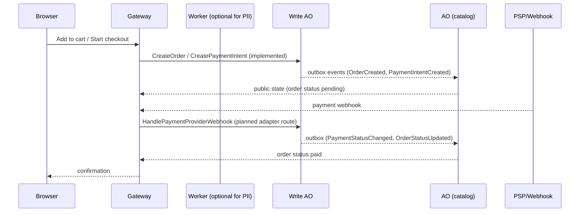
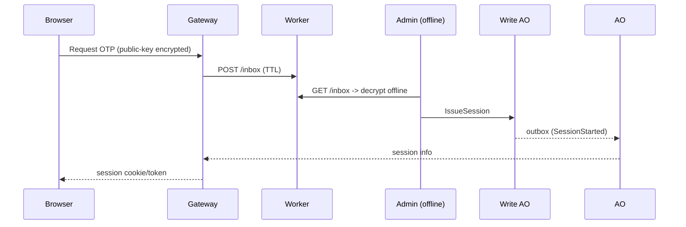
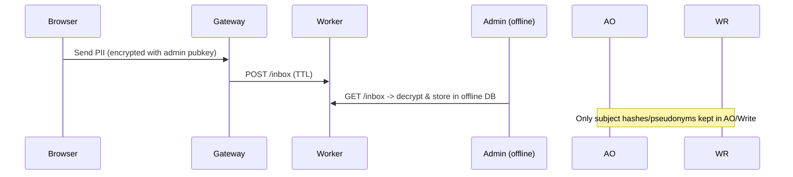
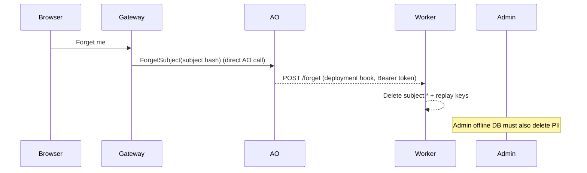
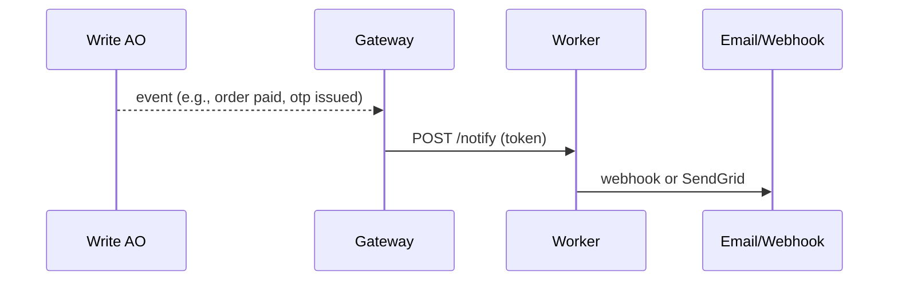

# End-to-end Flows (AO / Write / Gateway / Worker)

Goal: cover 99%+ web/eshop use-cases with PII kept offline/TTL.

Implementation status note (2026-04-14):
- Implemented adapter routes today: `POST /api/public/resolve-route`,
  `POST /api/public/page`, `POST /api/checkout/order`,
  `POST /api/checkout/payment-intent`.
- The worker endpoints `/inbox`, `/forget`, and `/notify` are implemented.
- Flows below marked as "planned" describe target-state orchestration not yet
  exposed as full adapter route coverage.

## Legend
- **Browser** – user client
- **Gateway** – edge/API gateway
- **Worker** – Cloudflare Worker (TTL inbox, notify)
- **Write AO** – command AO (truth source, emits outbox)
- **AO** – public/read AO (ingests outbox, public state)
- **Admin** – offline operator with private keys/offline DB

## Checkout & Payment (partially implemented)

## Passwordless / OTP Login (planned)

## PII Upload (address/docs)

## Forget / GDPR (planned orchestration, worker endpoint exists)

## Notifications (email/webhook)

## Reliability & Data-Safety Notes
- **Persistence path**: AO/Write emit PII-scrubbed state snapshots and WAL/outbox/idempotency into the WeaveDB export log; operators bundle this into WeaveDB for durable, immutable public state. Local snapshots (`AO_STATE_DIR` / `WRITE_STATE_DIR`) are only restart aids.
- **TTL/Cache**: Gateway keeps encrypted envelopes only within a bounded TTL window; cache hit/miss metrics + wipe-on-expire are required for deployment readiness. Expired entries must be wiped proactively; cache TTL is configurable per merchant and must never exceed worker inbox TTL.
- **Worker guarantees**: HMAC-verified inbox, rate limit + replay window, delete-on-download + scheduled janitor, auth-protected forget/notify endpoints.
- **PSP/webhooks**: Write AO can emit payment status events; adapter routes for webhook/status forwarding are still planned.
- **GDPR split**: No PII is stored on AO/Write/WeaveDB; sensitive blobs live only in Worker TTL cache and the administrator’s offline DB (delete-on-download + ForgetSubject hook).

## Gateway Cache Policy (encrypted envelopes)
- TTL window = min(worker inbox TTL, merchant-configured max); default 15–60 minutes.
- On expiry: wipe cache entry and emit cache_expired metric.
- Metrics: cache_hit, cache_miss, cache_expired, cache_wipe_error.
- ForgetSubject-triggered cache wipe is target-state and should be wired during deployment.

## PSP/Webhook Reliability
- Retry/backoff with jitter (e.g., 3–5 attempts, 1s→32s).
- Signature verify and cert cache (e.g., PayPal) with periodic refresh.
- Circuit breaker per PSP endpoint; metrics: breaker_open, breaker_half_open, retry_lag_seconds.
- Webhook status changes emitted to AO ingest (`PaymentStatusChanged`, `OrderStatusUpdated`).

## Observability / Alerts
- Ingest apply failures (AO and Write) — alert on error rate > 0 over 5m.
- Outbox/queue lag (write) — alert on lag > N seconds.
- PSP breaker open ratio — alert if breaker_open > threshold.
- Webhook retry backlog — alert on retry queue length/age.
- Gateway cache hit ratio — monitor; alert on miss spike if upstream healthy.
- Worker inbox janitor failures and rate-limit overage spikes (429s).
